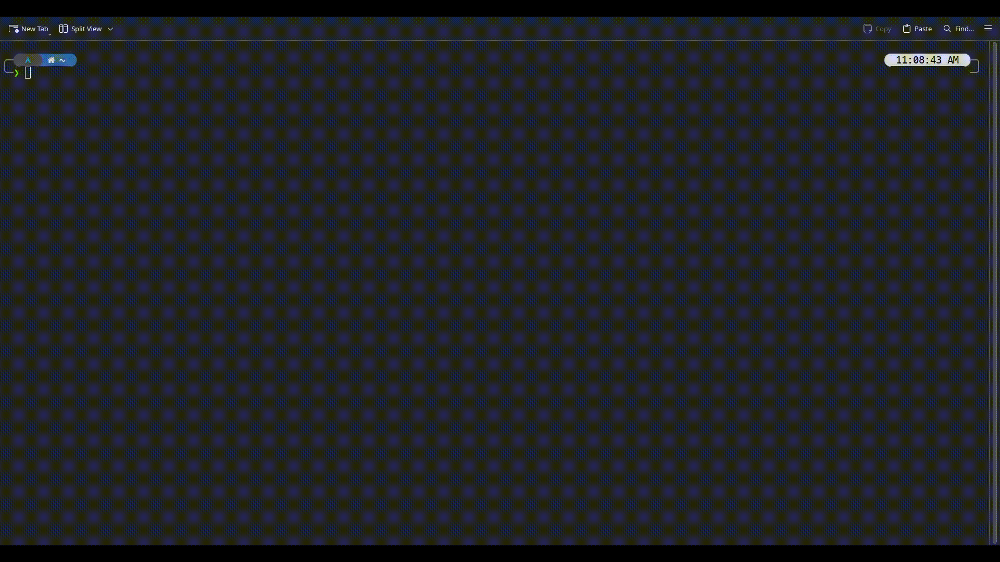

# Stormfetch
## A simple linux fetch program written in go and bash

### Developers:
- [CapCreeperGR ](https://gitlab.com/CapCreeperGR)

### Project Information
Stormfetch is a program that can read your system's information and display it in the terminal along with the ASCII art of the Linux distribution you are running.
Stormfetch is still in beta, so distro compatibility is limited. If you would like to contribute ASCII art or add other compatibility features feel free to create a pull request or notify me through GitLab Issues.

### How it looks


### Installation Guide
#### Using a package manager
- Arch Linux: You may use your favorite AUR manager to install the `stormfetch` package
#### Building from source
- Download `go` from your package manager or from the go website
- Download `make` from your package manager
- (Optional) Download `xorg-xhost` from your package manager to display DE/WM and monitor information
- (Optional) Download `xorg-xdpyinfo` from your package manager to display screen resolution
- Run the following command to compile the project
```
make
```
- Run the following command to install stormfetch into your system. You may also append a DESTDIR variable at the end of this line if you wish to install in a different location
```
make install PREFIX=/usr SYSCONFDIR=/etc
```
