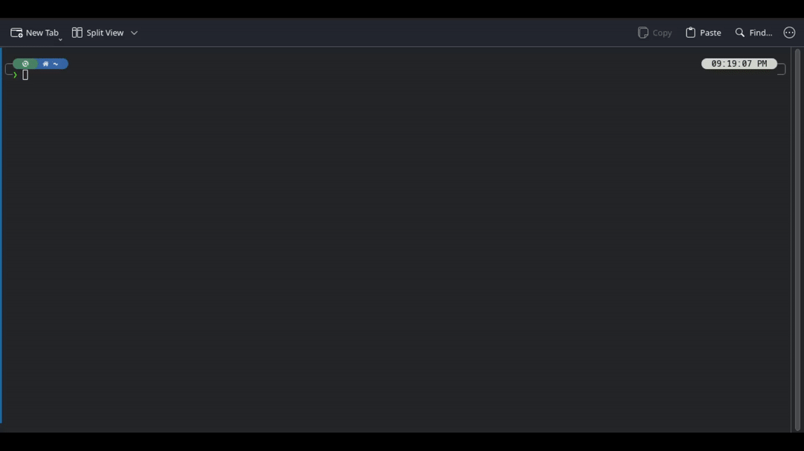

# Stormfetch
## A simple linux fetch program written in go

### Project Information
Stormfetch is a program that can read your system's information and display it in the terminal along with the ASCII art of the Linux distribution you are running.
At the moment ascii art for different distributions is limited. If you would like to contribute ascii art feel free to make a pull request.

### How it looks


### Installation Guide
#### Using a package manager
- Arch Linux: You may use your favorite AUR manager to install the `stormfetch` package
#### Building from source
- Download `go` from your package manager or from the go website
- Download `make` from your package manager
- Run the following command to compile the project
```
make SYSCONFDIR=/etc
```
- Run the following command to install stormfetch into your system. You may also append a DESTDIR variable at the end of this line if you wish to install in a different root directory
```
make install
make install-config SYSCONFDIR=/etc
```
### Post installation
- (Optional) Download `curl` from your package manager to fetch the amdgpu.ids database for AMD GPUs. It may be safely uninstalled after running stormfetch once with curl installed
